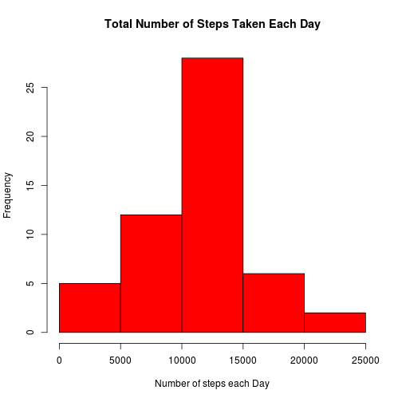
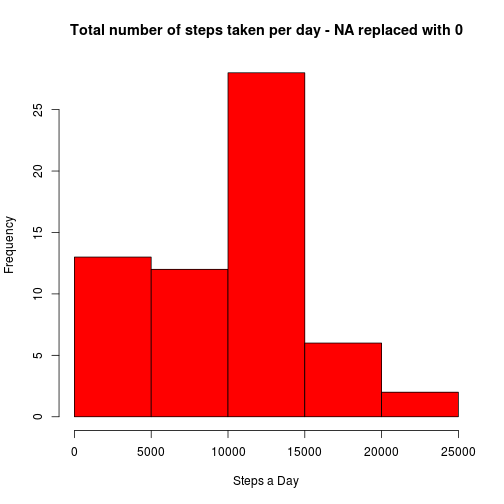
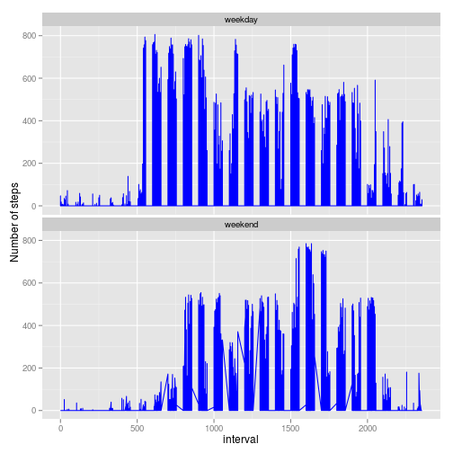

# Reproducible Research: Peer Assessment 1
==========================================
#### By Sumeet Garnaik

### This is an assignment regarding the Course, Reproducible Research offered by JHU on Coursera.

## 1) Loading and preprocessing the data

### We load the data.

```r
# unzipping and loading data from the file
activityData <- read.csv(unz(description="activity.zip",filename="activity.csv"),stringsAsFactors=F)
```


### Clean it up a bit to perform the required computations.

```r
# converting date into Date format
activityData$date <- as.Date(activityData$date, format="%Y-%m-%d")

# remove NAs
activityDataNoNA <- activityData[!is.na(activityData$steps), ]
row.names(activityDataNoNA) <- NULL
```
## 2) What is mean total number of steps taken per day?

### Make a histogram of the total number of steps taken each day

```r
# data plotting
require(plyr)
stepsDay <- ddply(activityDataNoNA, .(date), summarize, steps = sum(steps))
hist(stepsDay$steps, xlab = "Number of steps each Day", col = "red", main = "Total Number of Steps Taken Each Day")
```

 

### We compute the mean total number of steps taken per day and find the mean and median.

```r
# mean and median of total number of steps taken per day
summaryData <- summary(stepsDay$steps)
meanPerDay <- summaryData["Mean"]
medianPerDay <- summaryData["Median"]
```

### *The mean steps taken per day is 1.08 &times; 10<sup>4</sup> steps and median steps taken per day is 1.08 &times; 10<sup>4</sup> steps.

## 3) What is the average daily activity pattern?

### Make a time series plot (i.e. type = "l") of the 5-minute interval (x-axis) and the average number of steps taken, averaged across all days (y-axis)

```r
# data plotting
require(plyr)
stepsInt <- ddply(activityDataNoNA, .(interval), summarize, steps=mean(steps))
plot(x=stepsInt$interval, y=stepsInt$steps, type="l", xlab="Time interval of 5 mins", ylab="Average number of steps", main="Average daily activity pattern")
```

 

### Which 5-minute interval, on average across all the days in the dataset, contains the maximum number of steps?

```r
# max interval
maxInt <- stepsInt[stepsInt$steps == max(stepsInt$steps), ]
row.names(maxInt) <- NULL
maxInt <- maxInt["interval"]
```

### *The 835th interval contains the maximum number of steps on an average.

## 4) Imputing missing values

### Calculate and report the total number of missing values in the dataset (i.e. the total number of rows with NAs)

```r
# find the number of missing value
missingValues <- sum(is.na(activityData))
```

### *The total number of missing values in the dataset is 2304.

### Devise a strategy for filling in all of the missing values in the dataset. The strategy does not need to be sophisticated.  Create a new dataset that is equal to the original dataset but with the missing data filled in.

```r
# fill up the missing value in a data set same as the original set without the NAs
newData <- activityData
newData[is.na(newData)] <- 0
newData$date <- as.Date(newData$date, format="%Y-%m-%d")
```


### Make a histogram of the total number of steps taken each day.

```r
# create data and plot required
require(plyr)
stepsDayMissing <- ddply(newData, .(date), summarize, steps=sum(steps))
hist(stepsDayMissing$steps, xlab="Steps a Day", col="red", main="Total number of steps taken per day - NA replaced with 0")
```

 


### Calculate and report the mean and median total number of steps taken per day.

```r
# mean and median in case of missing value included with replacing with 0
summaryMissing <- summary(stepsDayMissing$steps)
meanMissing <- summaryMissing["Mean"]
medianMissing <- summaryMissing["Median"]
```

### *Now comparing the means and medians:
*Original Dataset  
Mean: 1.08 &times; 10<sup>4</sup>  
Median: 1.08 &times; 10<sup>4</sup>  
*New Dataset  
Mean: 9350  
Median: 1.04 &times; 10<sup>4</sup>

## 5) Are there differences in activity patterns between weekdays and weekends?

*Use the dataset with the filled-in missing values for this part.

### Create a new factor variable in the dataset with two levels – “weekday” and “weekend” indicating whether a given date is a weekday or weekend day.

```r
# creating a new factor variable from weekday
weekdays = weekdays(newData$date)
weekdays = as.factor(ifelse(weekdays %in% c("Saturday","Sunday"), "weekend", "weekday"))
newData = cbind(newData, weekdays)
```

### Make a panel plot containing a time series plot (i.e. type = "l") of the 5-minute interval (x-axis) and the average number of steps taken, averaged across all weekday days or weekend days (y-axis).

```r
# create data and plot required
require(ggplot2)
ggplot(newData, aes(x=interval, y=steps))+geom_line(color="blue")+ylab("Number of steps")+facet_wrap(~weekdays, ncol=1)
```

 
